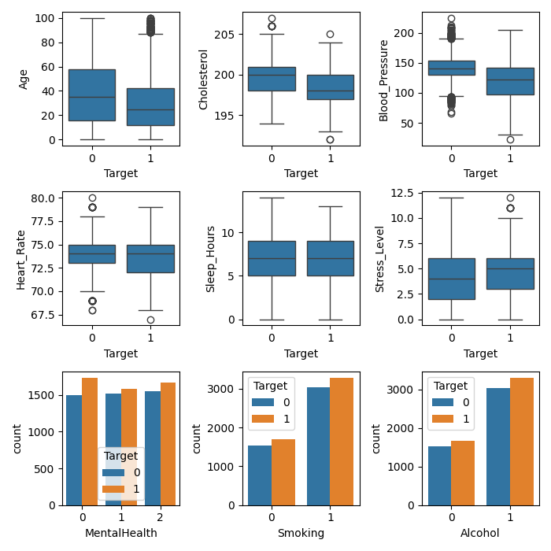
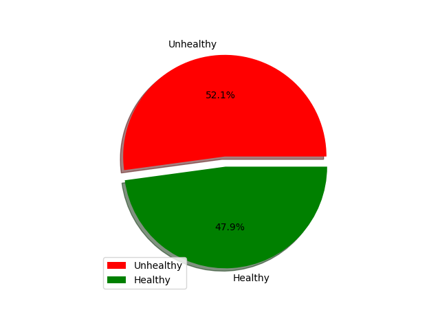
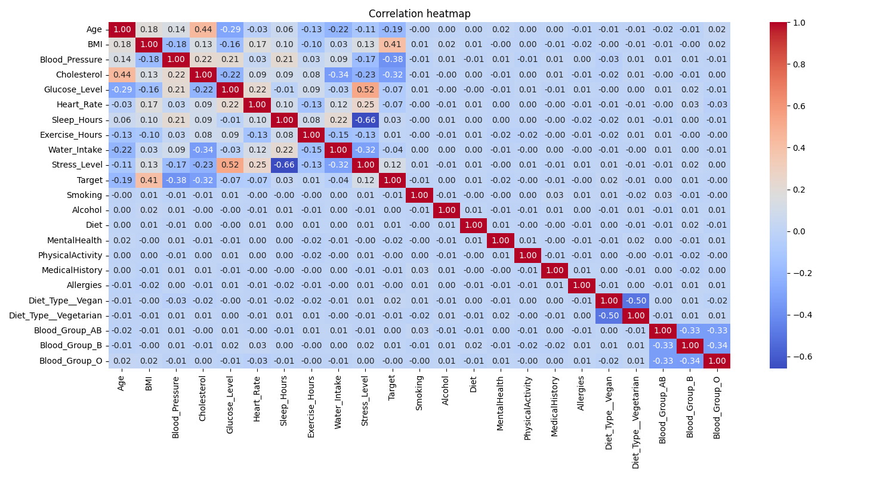
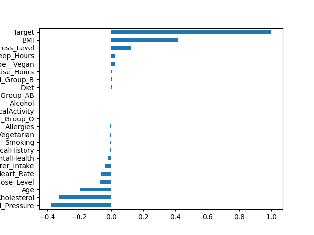
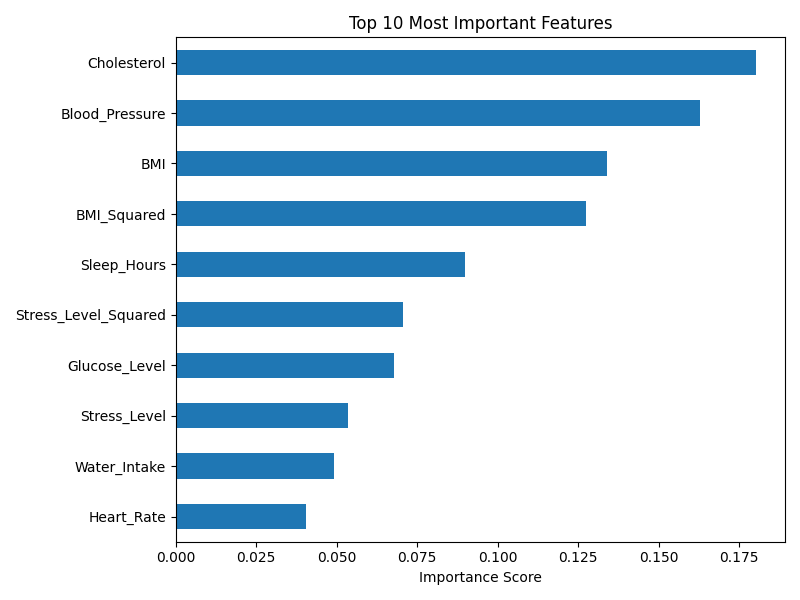
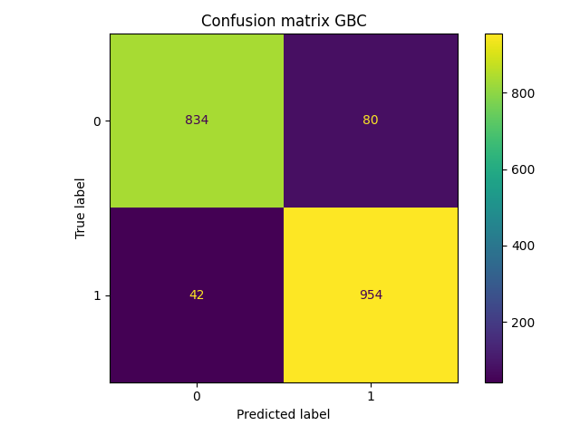
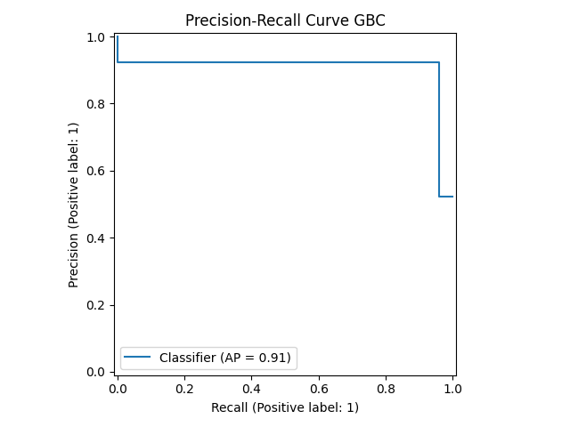

<p align="center">
  
</p>

<h1 align="center">🩺 NovaGen Labs: Lifestyle-Based Health Risk Prediction</h1>

<p align="center">
Predicting Health Risk from Lifestyle Questionnaire Responses using Machine Learning
</p>

<p align="center">


</p>

> **What if a simple lifestyle questionnaire could estimate your health risk before a single medical test is performed?**

At **NovaGen Labs** *(fictional healthcare research organization)*, every volunteer is asked to complete a lifestyle questionnaire covering daily habits, diet, stress levels, exercise, smoking, alcohol consumption and other health-related factors.

The objective of this project is to predict whether an individual is **Healthy** or **Unhealthy** using only questionnaire responses, allowing early identification of potentially at-risk individuals before laboratory testing.

---

##  Problem Statement

Traditional medical diagnosis often begins only after symptoms appear or clinical tests are conducted.

This project explores whether **machine learning can identify health risks using only lifestyle and behavioral information**, making it useful as an early screening tool.

Since incorrectly classifying an unhealthy individual as healthy can delay medical attention, the project prioritizes **Recall** over overall Accuracy.

---

##  Scenario

Imagine a healthcare startup called **NovaGen Labs**.

Before scheduling expensive laboratory tests, every visitor fills out a digital questionnaire containing information such as:

- Age
- BMI
- Blood Pressure
- Cholesterol
- Glucose Level
- Sleep Hours
- Exercise Hours
- Water Intake
- Smoking Habit
- Alcohol Consumption
- Stress Level
- Mental Health
- Physical Activity
- Medical History
- Diet Type
- and other lifestyle-related attributes.

Based solely on these responses, the model predicts whether the individual is likely to be **Healthy** or **Unhealthy**, helping prioritize patients who may require further medical evaluation.

---

# Dataset


| Attribute | Value |
|-----------|-------|
| Samples | 9,549 |
| Features | 22 |
| Target | Healthy / Unhealthy |
| Class Balance | 48% / 52% |
| Source | Synthetic Lifestyle Questionnaire |


---

# 🛠 Data Preprocessing

The following preprocessing steps were performed:

- Checked for missing values
- Removed duplicate records
- Converted Boolean columns into numerical values
- Simplified categorical health indicators into binary representations where appropriate
- Removed the **Allergies** feature due to negligible correlation with the target variable
- Performed train-test split
- Applied feature scaling where required

---

# ML Pipeline

Questionnaire Data

↓

Data Cleaning

↓

EDA

↓

Feature Engineering

↓

Train/Test Split

↓

Model Training

↓

Hyperparameter Tuning

↓

Model Evaluation

↓

Health Risk Prediction

---

# 📊 Exploratory Data Analysis

Before training the models, Exploratory Data Analysis (EDA) was performed to understand the dataset, identify important patterns, detect correlations, and determine which features contributed most to health risk prediction.

---

### 📌 Distribution of Features

The following plots summarize the distribution of important numerical and categorical features within the dataset.

<p align="center">
  
</p>

---

### 📌 Target Class Distribution

The target classes are nearly balanced, reducing the need for class balancing techniques during training.

<p align="center">
  
</p>

---

### 📌 Correlation Heatmap

A correlation heatmap was generated to study relationships among numerical features and detect multicollinearity.

<p align="center">
  
</p>

---

### 📌 Correlation with Target

Features were ranked according to their correlation with the target variable, helping identify the strongest predictors of health risk.

<p align="center">
  
</p>
---

# Feature Engineering

To improve the ability of linear and tree-based models to capture non-linear relationships:

- Removed the **Allergies** feature due to negligible correlation with the target.
- Created a **BMI²** feature to model the non-linear effect of Body Mass Index on health outcomes.
- Converted Boolean variables into numerical representations.

These transformations improved the model's ability to learn meaningful decision boundaries.
---

# Model Evaluation

Several machine learning algorithms were trained and compared using Recall as the primary evaluation metric.

The **Gradient Boosting Classifier** achieved the best performance and was selected as the final model.

---

### 📌 Feature Importance

The following visualization shows the relative importance of each feature learned by the Gradient Boosting model.

<p align="center">
  
</p>

---

### 📌 Confusion Matrix

The confusion matrix illustrates how well the model distinguishes between healthy and unhealthy individuals on unseen test data.

Since missing an unhealthy individual (False Negative) is more costly than generating a False Positive, Recall was prioritized throughout the project.

<p align="center">
  
</p>

---

### 📌 Precision-Recall Curve

The Precision-Recall Curve provides a more informative evaluation than Accuracy for healthcare screening tasks, where correctly identifying high-risk individuals is the primary objective.

<p align="center">
  
</p>

---

# 🏆 Final Results

| Model | Recall |
|--------|---------:|
| Logistic Regression | 81.90% |
| Voting Classifier | 82.93% |
| Random Forest | 92.50% |
| SVC | 95.18% |
| **Gradient Boosting** | **95.80%** ✅ |

After evaluating multiple machine learning models, the **Gradient Boosting Classifier** was selected as the final model due to its superior Recall, making it the most suitable choice for identifying potentially high-risk individuals while minimizing False Negatives.

---

## Why Recall?

In health screening applications, predicting a high-risk individual as healthy (False Negative) can delay medical intervention.

Therefore, Recall was chosen as the primary optimization metric to maximize identification of potentially unhealthy individuals.

---

# 🏆 Final Model

**Gradient Boosting Classifier**

Chosen because it achieved the highest Recall while maintaining strong overall performance.

Unlike bagging methods, Gradient Boosting learns sequentially by correcting previous mistakes, making it particularly effective for capturing complex interactions among multiple lifestyle factors.

---

# Evaluation Metrics

The final model was evaluated using:

- Accuracy
- Precision
- Recall
- F1 Score
- Confusion Matrix
- ROC Curve
- Precision-Recall Curve

---

# 💡 Key Learnings

- Recall can be a more appropriate metric than Accuracy in healthcare applications.
- Feature engineering can significantly improve predictive performance.
- Hyperparameter tuning greatly impacts tree-based models.
- RandomizedSearchCV provides a good balance between computational cost and performance compared to exhaustive GridSearchCV.
- Gradient Boosting effectively captures complex interactions among lifestyle variables.

---

# 📂 Project Structure

```
NovaGen-Labs-Health-Risk-Prediction/
│
├── .gitignore
├── README.md
├── requirements.txt
│
├── data/
│   └── novagen_dataset.xlsx
│
├── images/
│   ├── banner.png
│   ├── categories_distribution_charts.png
│   ├── correlation_heatmap.png
│   ├── correlation_with_target.png
│   ├── health_distribution.png
│   ├── most_important_features.png
│   ├── cm_gbc.png
│   └── precision_recall_curve_gbc.png
│
├── models/
│   └── gradient_boosting.joblib
│
└── notebooks/
    └── NovaGen_Labs.ipynb
```
---

# 🚀 Tech Stack

- Python
- Pandas
- NumPy
- Matplotlib
- Seaborn
- Scikit-Learn
- XGBoost

---
# 🚀 Future Improvements

- Develop a Streamlit web application for interactive predictions.
- Integrate SHAP for model explainability.
- Train on real-world healthcare datasets.
- Introduce probability-based risk scoring instead of binary classification.
- Add support for real-time questionnaire-based predictions.
---

# 📷 Project Preview

*(Add your visualizations here)*

- Correlation Heatmap
- Feature Importance
- ROC Curve
- Confusion Matrix
- Precision-Recall Curve
- Model Comparison

---

# ⚠ Disclaimer

This project was developed for **educational and machine learning demonstration purposes only**.

**NovaGen Labs is a fictional organization**, and the predictions generated by this model should **not** be interpreted as medical advice or used for real clinical decision-making.

---